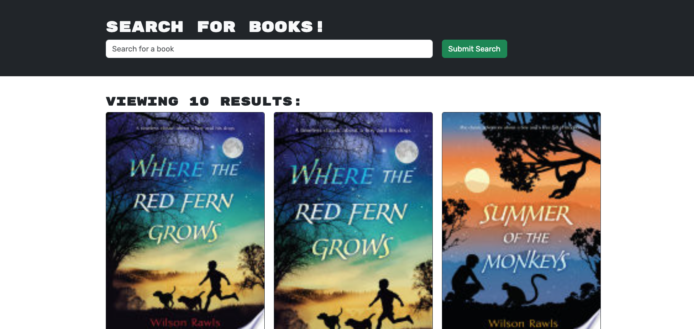

# Book-Search-Engine

## Description
The Book Search Engine is a powerful book search engine designed to nourish the literary curiosity of avid readers. Originally built using a RESTful API, this project has been refactored to leverage the capabilities of a GraphQL API powered by Apollo Server, providing a more flexible and efficient querying experience. The application enables users to search for books using the Google Books API and offers a seamless way to create personal reading lists by saving books to their profile.

By using the Apollo Server with GraphQL, Feed the Read optimizes data fetching and provides a robust, modern interface for book lovers to explore and organize their reading adventures.

## Installation

1. Clone the repository
Start by cloning the repository to your local machine using the following command:

```bash
git clone https://github.com/PedroChipana/Book-Search-Engine.git
```
2. Navigate to the project directory


Move into the directory of the project:

```bash
cd your-project-repo
```

3. Install dependencies

```bash
npm install
```

4. Run the Application Locally

```bash
npm run develop
```

## Usage

1. Search for Books
- On the homepage, you'll see a search bar where you can enter the title of a book.
- Type in your search query and press the "Submit Search" button.
- The application will fetch the results from the Google Books API and display a list of books matching your query.

2. Save Books to Your List
- For each book in the search results, there will be a "Save this book!" button.
- Clicking this button will add the book to your personal list, which is stored in your MongoDB database.

3. View Saved Books
- Navigate to the See Your Books page via the top menu or sidebar.
- Here, you'll find a list of all the books you've saved during previous searches.. 

4. Remove Books from Your List
- In the Saved Books section, there is a "Delete this Book!" button in each saved book. Clicking this button will remove that book from your list.



## Technologies Used

- React for building the front-end interface
- Apollo Server and GraphQL for API queries
- MongoDB and Mongoose for database management
- Express.js as the server framework
- Google Books API for book data
- JWT Authentication for secure user sessions

## Features

- Search for books using the Google Books API
- Save favorite books to a personal list stored in MongoDB
- User authentication using JSON Web Tokens (JWT)
- GraphQL integration with Apollo Server for efficient data management

## Future Improvements

- Add sorting and filtering options for saved books
- Implement a “Recommended Books” section based on user search history
- Allow users to leave reviews or ratings for saved books
- Optimize performance for faster API responses and page load times


## Questions
Please visity my GitHub profile: https://github.com/PeruvPowWow
For additional questions, please contact me at: pedro.chipana94@gmail.com
